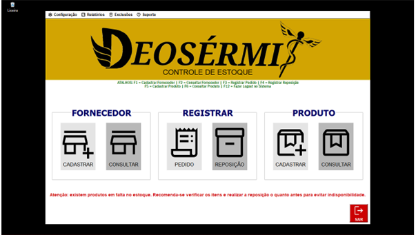
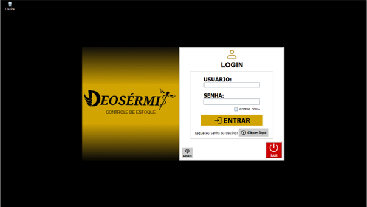
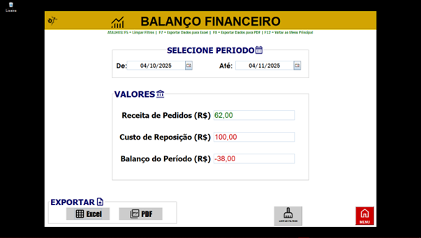
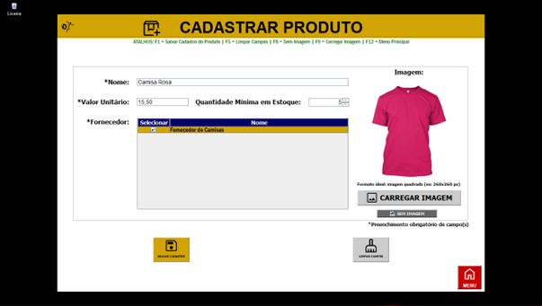
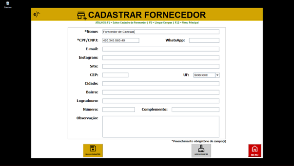
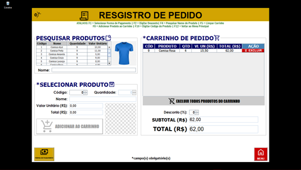

# Deosérmis – Sistema de Gestão de Estoque

Sistema completo de gestão de estoque com controle financeiro, autenticação de usuários, permissões por perfil e auditoria de operações, desenvolvido em Java com integração a banco de dados MySQL.

## Sobre o Projeto
O Deosérmis é uma aplicação desktop desenvolvida como Trabalho de Conclusão de Curso (TCC) da Fatec Zona Sul, voltada para microempreendedores que realizam vendas por redes sociais.

O sistema permite o controle completo de produtos, fornecedores, pedidos, reposições e relatórios financeiros, auxiliando na organização e tomada de decisões.

---

## Tecnologias Utilizadas

- Java (Swing)
- MySQL
- JDBC
- NetBeans
- UML
- Git e GitHub

---

## Arquitetura do Sistema

O sistema foi desenvolvido utilizando o padrão MVC (Model-View-Controller), com separação em camadas:

- View: Interface gráfica em Java Swing  
- Controller: Controle de fluxo e regras de negócio  
- Model: Representação das entidades do sistema  
- DAO: Acesso e manipulação de dados via JDBC  

---

## Segurança e Integridade

- Senhas armazenadas com hash e salt  
- Soft delete (exclusão lógica)  
- Auditoria de operações  
- Controle de acesso por perfil  

---

## Funcionalidades

- Cadastro de produtos e fornecedores  
- Controle de estoque (entrada e saída)  
- Registro de pedidos e reposições  
- Alertas de estoque mínimo  
- Relatórios financeiros  
- Controle de usuários e permissões  
- Backup de dados  

---

## Imagens do Sistema

### Tela de Login

### Tela Principal

### Balanço Financeiro

### Cadastro de Produto

### Cadastro de Fornecedor

### Registro de Pedido

---

## Como Executar o Projeto

1. Clonar o repositório:

Abra o terminal e execute:

git clone https://github.com/felipdjesus97/deosermis-controle-estoque

---

### 2. Abrir no NetBeans  

---

### 3. Configurar o MySQL
- Executar scripts da pasta `/database`

---

### 4. Ajustar conexão com banco no projeto  

---

### 5. Executar aplicação 

## Estrutura do Projeto

- /src → Código Java  
- /database → Scripts SQL  
- /docs → Documentação, Diagramas e Imagens  

---
### 6. Criar usuário administrador (primeiro acesso)

Antes de executar o sistema pela primeira vez, é necessário criar um usuário administrador.

Siga os passos:

1. Certifique-se de que o banco de dados já está criado e configurado.

2. No NetBeans, localize a classe:

/src/Master/CriandoADMmaster.java

3. Clique com o botão direito na classe e selecione **Run File** (ou pressione **Shift + F6**).

4. O sistema irá executar a criação do usuário administrador automaticamente.

5. Após isso, execute o sistema normalmente (F6).

Credenciais padrão:
- Usuário: adm  
- Senha: 123  

⚠️ Recomenda-se alterar a senha após o primeiro acesso.

---

## Contexto Acadêmico

Projeto desenvolvido como TCC da Fatec Zona Sul.

---

## Autor

Felipe de Jesus dos Reis  
https://www.linkedin.com/in/felipedejesus97  
https://github.com/felipdjesus97
